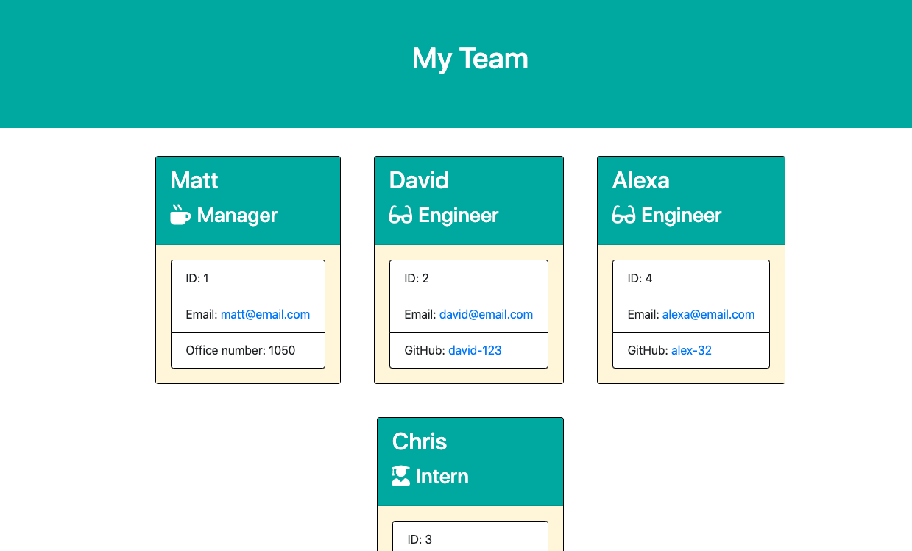

# Template Engine - Employee Summary

One of the most important aspects of programming is writing code that is readable, reliable, and maintainable. Oftentimes, _how_ we design our code is just as important as the code itself. In this homework assignment, your challenge is to build a Node CLI that takes in information about employees and generates an HTML webpage that displays summaries for each person. Since testing is a key piece in making code maintainable, you will also be ensuring that all unit tests pass.

# URL to Working Video

https://drive.google.com/file/d/1zy1InaFD4HtZp8bRTJuesSXYGTBps71w/view

# Summary

As a manager
I want to generate a webpage that displays my team's basic info
so that I have quick access to emails and GitHub profiles

© 2020 Matt Milici
